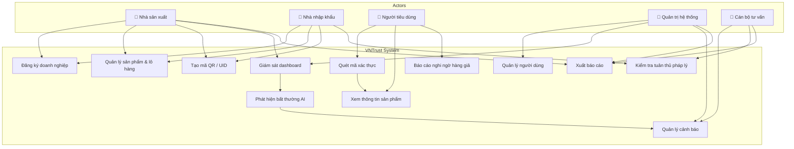
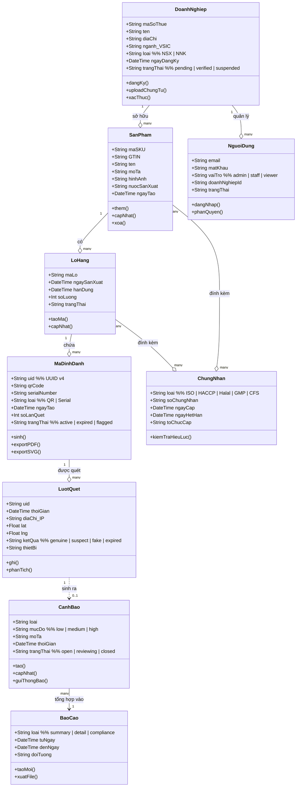
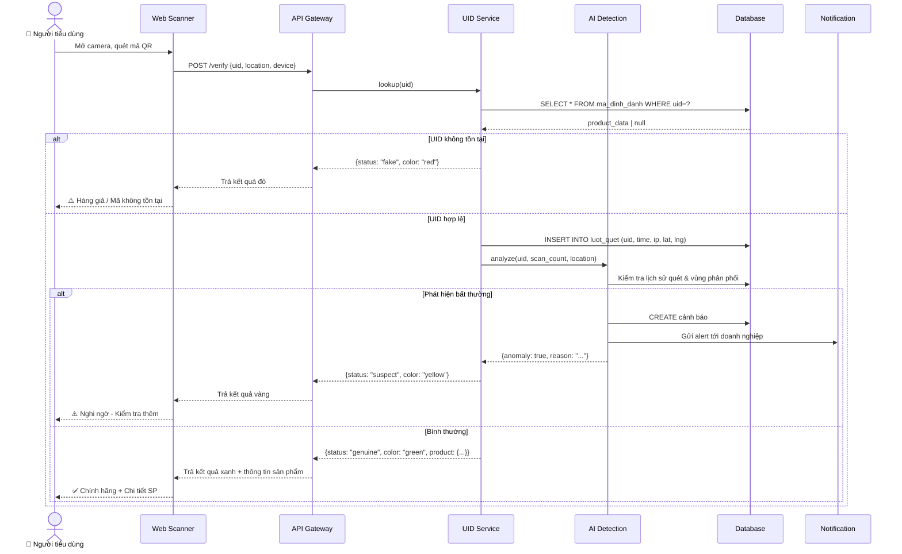
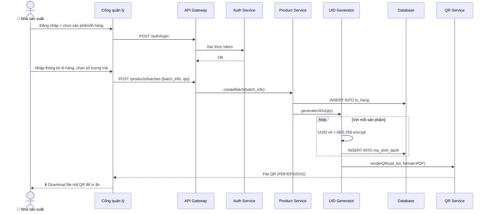
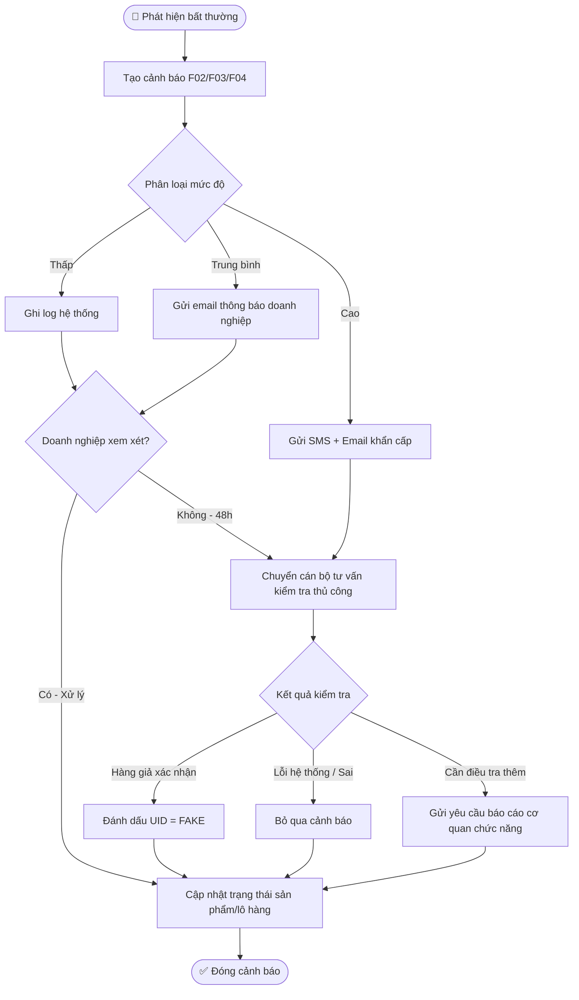
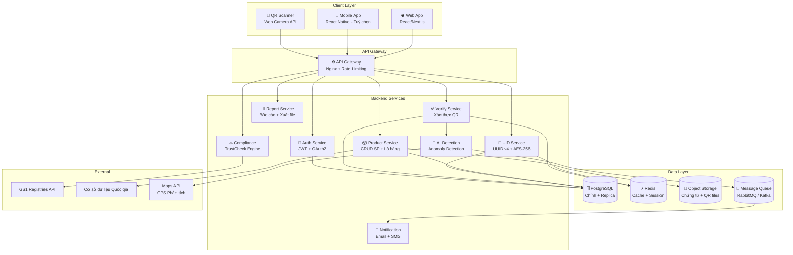
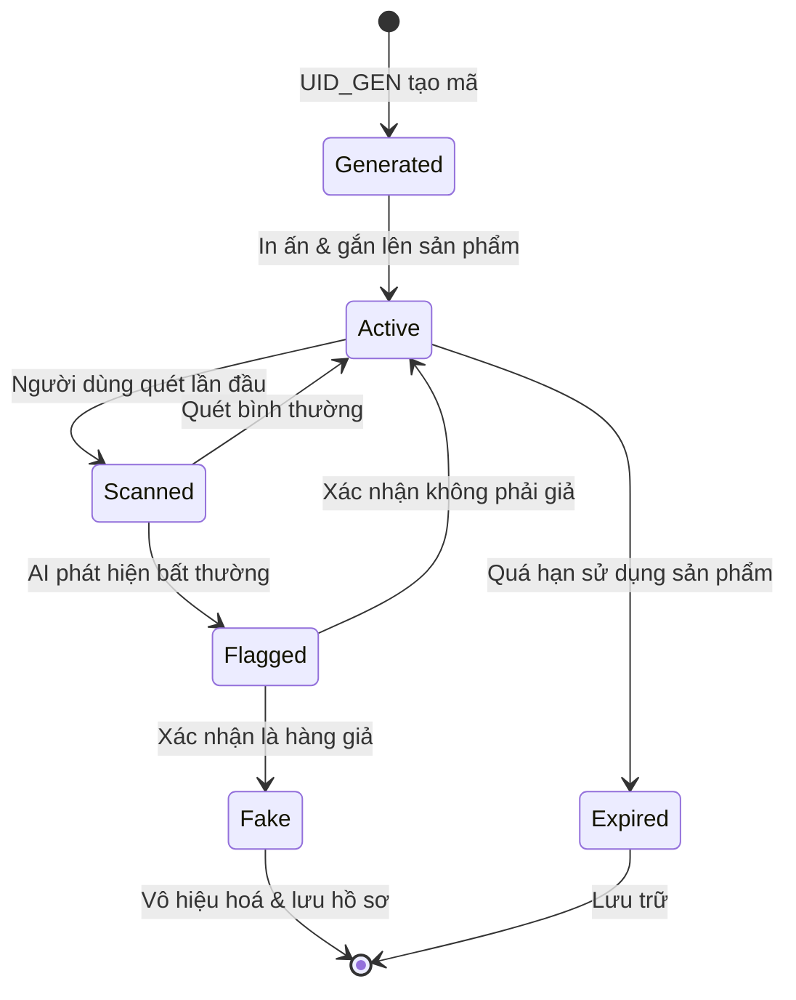

# VNTrust – Hệ thống Xác thực & Bảo vệ Thương hiệu Việt Nam

## Tổng quan

**VNTrust** là hệ thống xác thực và truy xuất nguồn gốc sản phẩm Việt Nam, lấy cảm hứng từ các giải pháp quốc tế như *Verified by GS1*, *Codikett 2.0* (Securikett), và *Red Points*. Hệ thống tạo "vân tay số" duy nhất cho mỗi sản phẩm, giúp người tiêu dùng xác minh hàng thật/giả qua quét mã QR, đồng thời trang bị cho doanh nghiệp bộ công cụ giám sát thị trường xám bằng AI.

> [!IMPORTANT]
> Hệ thống phải tuân thủ **Nghị định 37/2026/NĐ-CP** về truy xuất nguồn gốc và **TCVN 13275:2020** về mã QR.

---

## Các Actor (Người dùng)

| Vai trò | Mô tả |
|---|---|
| **Nhà sản xuất** | Đăng ký sản phẩm, quản lý mã số, tạo QR |
| **Nhà nhập khẩu** | Nhập khẩu & phân phối hàng hóa, quản lý lô |
| **Người tiêu dùng** | Quét mã, xác thực sản phẩm, báo cáo nghi ngờ |
| **Quản trị hệ thống** | Quản lý người dùng, giám sát, báo cáo tổng hợp |
| **Cán bộ tư vấn** | Nhận cảnh báo, kiểm tra thủ công, đề xuất hành động |

---

## 6 Phân hệ chính

### Phân hệ 1 – Quản lý Hồ sơ Doanh nghiệp & Sản phẩm
- Đăng ký doanh nghiệp (MST, tên, địa chỉ, ngành VSIC 2025)
- Upload & OCR chứng từ (ĐKKD, chứng nhận an toàn)
- Phân quyền nội bộ (admin, nhân viên nhập liệu, kho)
- Quản lý danh mục sản phẩm: SKU, GTIN, hình ảnh, lô hàng
- Đính kèm chứng nhận ISO, HACCP, Halal, Organic

### Phân hệ 2 – Tạo & Quản lý Mã Định danh Duy nhất
- UID: UUID v4 ngẫu nhiên + mã hóa AES-256
- Mã QR theo TCVN 13275:2020 (export PDF/EPS/SVG)
- Batch code: Alphanumeric theo quy tắc doanh nghiệp
- Serial Number cho sản phẩm giá trị cao
- QR chỉ là "khóa" tra cứu, không chứa thông tin nhạy cảm trực tiếp

### Phân hệ 3 – Xác thực Sản phẩm cho Người tiêu dùng
- Web-based scanner (camera trình duyệt)
- Mobile app (tùy chọn nâng cao, hỗ trợ phân tích vân tay)
- Kết quả 4 trạng thái:
  - 🟢 **Xanh** – Chính hãng
  - 🟡 **Vàng** – Nghi ngờ (quét nhiều lần, vị trí lạ)
  - 🔴 **Đỏ** – Hàng giả / Vi phạm
  - ⚫ **Xám** – Hết hạn
- Hiển thị: tên, thương hiệu, hình ảnh, ngày SX, HSD, chứng nhận, khuyến mãi

### Phân hệ 4 – Giám sát & Phát hiện Bất thường (AI-powered)
| Loại bất thường | Phương pháp | Hành động |
|---|---|---|
| Quét nhiều lần cùng UID | Hit count tracking | Cảnh báo sau ngưỡng (>3 lần/ngày) |
| Quét tại vị trí địa lý bất thường | Phân tích IP/GPS | So sánh với khu vực phân phối chính thức |
| Tần suất quét bất thường theo batch | Phân tích thống kê | Phát hiện lô hàng bị làm giả hàng loạt |
| Điểm tương đồng thấp (AI vision) | So sánh vector đặc trưng | Cảnh báo hàng giả cấp độ cao |

Dashboard: Tổng lượt quét, số cảnh báo, bản đồ quét địa lý, tỷ lệ thật/giả.

### Phân hệ 5 – Quản lý Cảnh báo & Báo cáo
Quy trình: Phát hiện → Tạo cảnh báo → Phân loại mức độ (Thấp/Trung/Cao) → Gửi thông báo → Kiểm tra thủ công → Cập nhật trạng thái

Các loại báo cáo:
- Báo cáo tóm tắt (Ban lãnh đạo)
- Báo cáo chi tiết lô hàng (Quản lý chất lượng)
- Báo cáo checklist tuân thủ (CFS, GMP, C/O, GTIN)

### Phân hệ 6 – Tuân thủ & Pháp lý (TrustCheck)
- Kiểm tra ngày hết hạn chứng nhận (ISO, HACCP)
- Kiểm tra sự hiện diện giấy tờ bắt buộc (CFS, GMP, C/O)
- Kiểm tra tính hợp lệ mã số GTIN
- Báo cáo tổng hợp tuân thủ Nghị định 37/2026/NĐ-CP

---

## Lộ trình phát triển

| Phase | Thời gian | Tính năng |
|---|---|---|
| **Phase 1** | 2–3 tuần | Checklist tĩnh, rule engine cơ bản (ngày hết hạn EXP/ISO/HACCP) |
| **Phase 2** | 3–4 tuần | Mở rộng kiểm tra CFS/GMP/C/O, GTIN, báo cáo tổng hợp |
| **Phase 3** | 2–3 tuần | Cảnh báo tự động, gợi ý hành động thông minh, AI anomaly detection |

---

## UML Diagrams

### 1. Use Case Diagram



---

### 2. Class Diagram (Data Model)



---

### 3. Sequence Diagram – Xác thực sản phẩm (Người tiêu dùng)



---

### 4. Sequence Diagram – Tạo mã QR (Nhà sản xuất)



---

### 5. Activity Diagram – Quy trình xử lý cảnh báo



---

### 6. Component Diagram (Kiến trúc hệ thống)



---

### 7. State Diagram – Trạng thái Mã Định danh (UID)



---

## Kế hoạch kỹ thuật triển khai

### Tech Stack đề xuất

| Layer | Công nghệ |
|---|---|
| **Frontend** | Next.js 14 (App Router), TailwindCSS, ShadCN UI |
| **Backend** | Node.js (NestJS) hoặc Go (Gin) |
| **Database** | PostgreSQL (chính) + Redis (cache) |
| **QR Engine** | qrcode.js + pdfkit (xuất file) |
| **AI/ML** | Python FastAPI microservice (scikit-learn, isolation forest) |
| **Auth** | JWT + OAuth2 (Google, Zalo) |
| **Storage** | MinIO (self-hosted) hoặc AWS S3 |
| **Queue** | RabbitMQ hoặc BullMQ |
| **DevOps** | Docker + Nginx + GitHub Actions CI/CD |

### API Endpoints chính

```
POST   /api/auth/register          - Đăng ký doanh nghiệp
POST   /api/auth/login             - Đăng nhập
POST   /api/products               - Thêm sản phẩm
POST   /api/products/:id/batches   - Tạo lô hàng
POST   /api/batches/:id/generate   - Tạo UID hàng loạt
GET    /api/verify/:uid            - Xác thực QR (public)
GET    /api/dashboard              - Dashboard giám sát
GET    /api/alerts                 - Danh sách cảnh báo
PATCH  /api/alerts/:id             - Cập nhật trạng thái cảnh báo
GET    /api/reports/:type          - Xuất báo cáo
POST   /api/compliance/check       - Kiểm tra tuân thủ
```

---

## Câu hỏi mở (Cần xác nhận)

> [!IMPORTANT]
> **Ưu tiên phát triển**: Bắt đầu từ web portal hay mobile app trước?

> [!IMPORTANT]
> **Mô hình kinh doanh**: SaaS theo gói (số lượng sản phẩm/tháng) hay theo lượt quét? Điều này ảnh hưởng đến thiết kế billing module.

> [!WARNING]
> **Tích hợp GS1**: Cần tài khoản GS1 Việt Nam và phí thành viên. Có tích hợp không hay dùng UID nội bộ?

> [!NOTE]
> **AI Detection**: Giai đoạn đầu có thể dùng rule-based (threshold quét), AI vision cho giai đoạn sau. Có đồng ý không?
