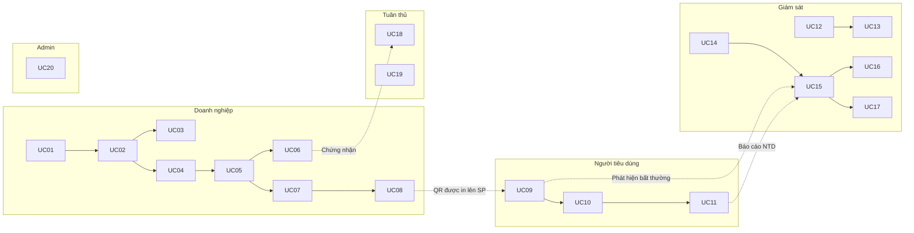

# VNTrust – Use Case Chi Tiết Từng Chức Năng

> **Phiên bản:** 1.0 | **Ngày:** 2026-04-08  
> **Hệ thống:** VNTrust – Xác thực & Bảo vệ Thương hiệu Việt Nam

---

## Danh mục Use Case

| Mã | Tên Use Case | Phân hệ | Actor chính |
|---|---|---|---|
| UC01 | Đăng ký tài khoản doanh nghiệp | PH1 | Nhà sản xuất, Nhà nhập khẩu |
| UC02 | Upload & xác thực chứng từ doanh nghiệp | PH1 | Nhà sản xuất, Nhà nhập khẩu |
| UC03 | Quản lý phân quyền nội bộ | PH1 | Admin doanh nghiệp |
| UC04 | Thêm/sửa/xóa sản phẩm | PH1 | Nhà sản xuất, Nhà nhập khẩu |
| UC05 | Quản lý lô hàng | PH1 | Nhà sản xuất, Nhà nhập khẩu |
| UC06 | Đính kèm chứng nhận vào sản phẩm | PH1 | Nhà sản xuất, Nhà nhập khẩu |
| UC07 | Tạo mã UID & QR hàng loạt | PH2 | Nhà sản xuất, Nhà nhập khẩu |
| UC08 | Xuất file in ấn mã QR | PH2 | Nhà sản xuất, Nhà nhập khẩu |
| UC09 | Quét mã QR xác thực sản phẩm | PH3 | Người tiêu dùng |
| UC10 | Xem thông tin chi tiết sản phẩm | PH3 | Người tiêu dùng |
| UC11 | Báo cáo nghi ngờ hàng giả | PH3 | Người tiêu dùng |
| UC12 | Xem Dashboard giám sát | PH4 | Doanh nghiệp, Quản trị HT |
| UC13 | Xem bản đồ quét địa lý | PH4 | Doanh nghiệp, Quản trị HT |
| UC14 | Cấu hình ngưỡng cảnh báo | PH4 | Quản trị hệ thống |
| UC15 | Xem & xử lý cảnh báo | PH5 | Doanh nghiệp, Cán bộ tư vấn |
| UC16 | Xuất báo cáo tóm tắt | PH5 | Ban lãnh đạo, Quản trị HT |
| UC17 | Xuất báo cáo chi tiết lô hàng | PH5 | Quản lý chất lượng |
| UC18 | Kiểm tra tuân thủ chứng nhận | PH6 | Cán bộ tư vấn, Nhà nhập khẩu |
| UC19 | Kiểm tra tính hợp lệ GTIN | PH6 | Cán bộ tư vấn |
| UC20 | Quản lý người dùng (Admin hệ thống) | Admin | Quản trị hệ thống |

---

## PHÂN HỆ 1 – Quản lý Hồ sơ Doanh nghiệp & Sản phẩm

---

### UC01 – Đăng ký Tài khoản Doanh nghiệp

| Thuộc tính | Nội dung |
|---|---|
| **Actor chính** | Nhà sản xuất / Nhà nhập khẩu |
| **Actor phụ** | Hệ thống OCR, CSDL Quốc gia |
| **Mục tiêu** | Tạo tài khoản doanh nghiệp trên hệ thống VNTrust |

**Điều kiện tiên quyết (Preconditions):**
- Doanh nghiệp chưa có tài khoản trên hệ thống
- Doanh nghiệp có Mã số thuế (MST) hợp lệ

**Luồng chính (Main Flow):**

| Bước | Actor | Hành động |
|---|---|---|
| 1 | DN | Truy cập trang đăng ký tại `/register` |
| 2 | DN | Nhập thông tin: MST, tên DN, địa chỉ, ngành VSIC 2025, loại hình (NSX/NNK) |
| 3 | DN | Nhập thông tin người đại diện: họ tên, email, số điện thoại, chức vụ |
| 4 | DN | Tạo mật khẩu tài khoản |
| 5 | HT | Kiểm tra MST không trùng trong CSDL |
| 6 | HT | Gửi email xác nhận đến địa chỉ email đã đăng ký |
| 7 | DN | Kích hoạt tài khoản qua link email |
| 8 | HT | Chuyển sang UC02 – Upload chứng từ để hoàn tất xác thực |

**Luồng thay thế (Alternative Flows):**

- **A1 – MST đã tồn tại:** Hệ thống hiển thị lỗi "Mã số thuế đã được đăng ký", gợi ý liên hệ hỗ trợ
- **A2 – Email không hợp lệ:** Hệ thống validate và yêu cầu nhập lại
- **A3 – Hết thời gian kích hoạt (48h):** Link hết hạn, DN phải yêu cầu gửi lại email xác nhận

**Điều kiện sau (Postconditions):**
- Tài khoản tạo thành công với trạng thái `pending_verification`
- Hệ thống lưu log thời gian đăng ký

---

### UC02 – Upload & Xác thực Chứng từ Doanh nghiệp

| Thuộc tính | Nội dung |
|---|---|
| **Actor chính** | Nhà sản xuất / Nhà nhập khẩu |
| **Actor phụ** | Module OCR, AI kiểm tra chứng từ, CSDL Quốc gia |
| **Mục tiêu** | Xác minh tính hợp lệ của doanh nghiệp qua chứng từ |

**Điều kiện tiên quyết:**
- Đã hoàn thành UC01
- Tài khoản đang ở trạng thái `pending_verification`

**Luồng chính:**

| Bước | Actor | Hành động |
|---|---|---|
| 1 | DN | Đăng nhập vào portal |
| 2 | DN | Upload scan Giấy đăng ký kinh doanh (ĐKKD) – file PDF/JPG/PNG, tối đa 10MB |
| 3 | DN | Upload các chứng nhận an toàn liên quan (tùy ngành: ISO, HACCP, v.v.) |
| 4 | HT/OCR | Tự động trích xuất thông tin từ ĐKKD: tên DN, MST, địa chỉ, ngành nghề |
| 5 | HT | Đối chiếu thông tin OCR với dữ liệu đăng ký ban đầu |
| 6 | HT | Tra cứu MST trên CSDL Quốc gia để xác minh DN đang hoạt động |
| 7 | HT | Nếu khớp > 90%: tự động duyệt → trạng thái `verified` |
| 8 | HT | Gửi email thông báo duyệt thành công, cho phép sử dụng đầy đủ chức năng |

**Luồng thay thế:**

- **A1 – OCR sai < 90%:** Chuyển sang kiểm tra thủ công bởi Quản trị hệ thống
- **A2 – MST không tìm thấy trên CSDL Quốc gia:** Yêu cầu DN cung cấp thêm bằng chứng
- **A3 – File không đọc được:** Thông báo lỗi, yêu cầu upload lại

**Postconditions:**
- Trạng thái DN chuyển thành `verified` hoặc `manual_review`
- Chứng từ được lưu vào Object Storage, liên kết với hồ sơ DN

---

### UC03 – Quản lý Phân quyền Nội bộ

| Thuộc tính | Nội dung |
|---|---|
| **Actor chính** | Admin doanh nghiệp |
| **Mục tiêu** | Tạo và phân quyền nhân viên trong doanh nghiệp |

**Điều kiện tiên quyết:**
- DN đã ở trạng thái `verified`
- Actor là người dùng có vai trò `company_admin`

**Luồng chính:**

| Bước | Actor | Hành động |
|---|---|---|
| 1 | Admin | Vào mục "Quản lý nhân viên" |
| 2 | Admin | Nhập email nhân viên cần thêm |
| 3 | Admin | Chọn vai trò: `admin` / `staff_input` / `warehouse` / `viewer` |
| 4 | HT | Gửi email mời nhân viên tham gia |
| 5 | NV | Chấp nhận lời mời, tạo mật khẩu cá nhân |
| 6 | HT | Kích hoạt tài khoản nhân viên với quyền đã chọn |

**Luồng thay thế:**
- **A1 – Email đã tồn tại trong hệ thống:** Cảnh báo, cho phép mời vào với vai trò mới
- **A2 – Thu hồi quyền:** Admin chọn nhân viên → "Vô hiệu hóa" → phiên đăng nhập hiện tại bị hủy

**Ma trận phân quyền:**

| Chức năng | admin | staff_input | warehouse | viewer |
|---|:---:|:---:|:---:|:---:|
| Quản lý sản phẩm | ✅ | ✅ | ❌ | 👁️ |
| Tạo UID/QR | ✅ | ✅ | ✅ | ❌ |
| Xem Dashboard | ✅ | ❌ | ❌ | ✅ |
| Quản lý nhân viên | ✅ | ❌ | ❌ | ❌ |
| Xuất báo cáo | ✅ | ❌ | ❌ | ✅ |

---

### UC04 – Thêm / Sửa / Xóa Sản phẩm

| Thuộc tính | Nội dung |
|---|---|
| **Actor chính** | Nhà sản xuất, Nhà nhập khẩu (vai trò admin / staff_input) |
| **Mục tiêu** | Quản lý danh mục sản phẩm trong hệ thống |

**Điều kiện tiên quyết:**
- DN đã `verified`
- Actor có quyền `staff_input` trở lên

**Luồng chính – Thêm sản phẩm:**

| Bước | Actor | Hành động |
|---|---|---|
| 1 | NV | Vào "Danh mục sản phẩm" → "Thêm sản phẩm mới" |
| 2 | NV | Nhập thông tin cơ bản: Tên SP, mô tả, thương hiệu |
| 3 | NV | Nhập mã SKU (nội bộ) và GTIN (nếu có) |
| 4 | NV | Upload hình ảnh sản phẩm (tối đa 5 ảnh, mỗi ảnh < 5MB) |
| 5 | NV | Chọn danh mục ngành hàng |
| 6 | NV | Nhập thông tin sản xuất: nước sản xuất, nhà sản xuất gốc (với NNK) |
| 7 | NV | Lưu → Hệ thống sinh mã sản phẩm nội bộ |
| 8 | HT | Kiểm tra GTIN có hợp lệ không (nếu nhập) |
| 9 | HT | Lưu vào DB, trả về ID sản phẩm |

**Luồng chính – Sửa sản phẩm:**
- NV chọn sản phẩm → "Chỉnh sửa" → thay đổi thông tin → Lưu → HT ghi log thay đổi (ai, khi nào, thay đổi gì)

**Luồng chính – Xóa sản phẩm:**
- Chỉ xóa được nếu chưa có UID nào được phát hành
- Nếu đã có UID: chuyển trạng thái SP thành `archived`, không xóa thật

**Luồng thay thế:**
- **A1 – GTIN không hợp lệ:** Cảnh báo, cho phép lưu nháp hoặc sửa
- **A2 – Trùng mã SKU:** Hệ thống cảnh báo trùng, cho phép ghi đè hoặc đặt mã mới

---

### UC05 – Quản lý Lô hàng

| Thuộc tính | Nội dung |
|---|---|
| **Actor chính** | Nhà sản xuất, Nhà nhập khẩu |
| **Mục tiêu** | Tạo và theo dõi từng lô sản phẩm để truy xuất nguồn gốc |

**Điều kiện tiên quyết:**
- Sản phẩm đã được tạo (UC04 hoàn thành)

**Luồng chính:**

| Bước | Actor | Hành động |
|---|---|---|
| 1 | NV | Chọn sản phẩm → "Tạo lô hàng mới" |
| 2 | NV | Nhập mã lô (Batch Code) theo quy tắc doanh nghiệp |
| 3 | NV | Nhập ngày sản xuất, ngày hết hạn |
| 4 | NV | Nhập số lượng sản phẩm trong lô |
| 5 | NV | Nhập địa điểm sản xuất / kho xuất phát |
| 6 | NV | Đính kèm phiếu kiểm soát chất lượng (nếu có) |
| 7 | HT | Lưu lô hàng, chuẩn bị cho bước tạo UID (UC07) |

**Thông tin theo dõi:**
- Trạng thái lô: `created` → `qr_generated` → `distributed` → `completed`
- Lịch sử thay đổi trạng thái, ai thay đổi, thời gian

---

### UC06 – Đính kèm Chứng nhận vào Sản phẩm / Lô hàng

| Thuộc tính | Nội dung |
|---|---|
| **Actor chính** | Nhà sản xuất, Nhà nhập khẩu |
| **Mục tiêu** | Liên kết giấy chứng nhận chất lượng với sản phẩm để hiển thị khi quét QR |

**Điều kiện tiên quyết:** Sản phẩm đã tạo, chứng nhận còn hiệu lực

**Luồng chính:**

| Bước | Actor | Hành động |
|---|---|---|
| 1 | NV | Vào sản phẩm → tab "Chứng nhận" |
| 2 | NV | Chọn loại chứng nhận: ISO 9001 / HACCP / Halal / Organic / GMP / CFS / C/O / v.v. |
| 3 | NV | Nhập số chứng nhận, tổ chức cấp, ngày cấp, **ngày hết hạn** |
| 4 | NV | Upload file chứng nhận (PDF/JPG) |
| 5 | HT | Lưu và gắn vào sản phẩm |
| 6 | HT | Lên lịch kiểm tra tự động trước ngày hết hạn 30/15/7 ngày → cảnh báo |

**Postconditions:**
- Chứng nhận hiển thị trên trang kết quả quét QR
- Hệ thống theo dõi ngày hết hạn cho module TrustCheck (UC18)

---

## PHÂN HỆ 2 – Tạo & Quản lý Mã Định danh

---

### UC07 – Tạo Mã UID & QR Hàng loạt

| Thuộc tính | Nội dung |
|---|---|
| **Actor chính** | Nhà sản xuất, Nhà nhập khẩu (warehouse / staff trở lên) |
| **Actor phụ** | UID Generator Service, QR Render Service |
| **Mục tiêu** | Sinh mã định danh duy nhất và mã QR tương ứng cho từng sản phẩm trong lô |

**Điều kiện tiên quyết:**
- Lô hàng đã được tạo (UC05)
- DN đã `verified`

**Luồng chính:**

| Bước | Actor | Hành động |
|---|---|---|
| 1 | NV | Chọn lô hàng → "Tạo mã QR" |
| 2 | NV | Xác nhận số lượng mã cần tạo (= số lượng SP trong lô) |
| 3 | NV | Chọn tùy chọn: có Serial Number riêng không? (cho SP giá trị cao) |
| 4 | HT | Validate quota mã QR còn lại trong gói dịch vụ |
| 5 | HT/UID | Sinh UUID v4 ngẫu nhiên cho từng sản phẩm |
| 6 | HT | Mã hóa UID bằng AES-256 trước khi nhúng vào QR |
| 7 | HT | Lưu UID vào DB kèm metadata: product_id, batch_id, ngày tạo, trạng thái `generated` |
| 8 | HT | Render mã QR theo chuẩn TCVN 13275:2020 |
| 9 | HT | Thông báo hoàn tất, chuyển sang UC08 để xuất file |

**Quy tắc quan trọng:**
- UID phải **non-guessable, non-sequential** – hoàn toàn ngẫu nhiên
- QR chỉ chứa URL tra cứu dạng `https://vntrust.vn/v/{encrypted_uid}`, không chứa thông tin thật
- Mỗi UID chỉ được tạo **một lần duy nhất**, không thể tái sử dụng

**Luồng thay thế:**
- **A1 – Hết quota gói dịch vụ:** Thông báo, gợi ý nâng cấp gói
- **A2 – Số lượng > 10,000/lần:** Tách thành job background, gửi email khi hoàn tất

---

### UC08 – Xuất File In ấn Mã QR

| Thuộc tính | Nội dung |
|---|---|
| **Actor chính** | Nhà sản xuất, Nhà nhập khẩu |
| **Mục tiêu** | Tải về file mã QR đã thiết kế sẵn để đưa cho nhà in |

**Điều kiện tiên quyết:** UC07 đã hoàn thành

**Luồng chính:**

| Bước | Actor | Hành động |
|---|---|---|
| 1 | NV | Vào lô hàng đã tạo mã → "Xuất file QR" |
| 2 | NV | Chọn định dạng: **PDF** (in thương mại) / **SVG** (vector) / **EPS** (trước in) / **PNG** |
| 3 | NV | Chọn kích thước QR: 2cm / 3cm / 5cm / tùy chỉnh |
| 4 | NV | Chọn layout: 1 mã/trang, lưới nhiều mã/trang (tiết kiệm giấy) |
| 5 | NV | Tùy chọn thêm: in logo thương hiệu vào giữa QR, in serial number bên dưới |
| 6 | HT | Render file, nén thành ZIP nếu > 100 mã |
| 7 | HT | Cung cấp link download (hết hạn sau 24h) |

---

## PHÂN HỆ 3 – Xác thực Sản phẩm cho Người tiêu dùng

---

### UC09 – Quét Mã QR Xác thực Sản phẩm

| Thuộc tính | Nội dung |
|---|---|
| **Actor chính** | Người tiêu dùng |
| **Actor phụ** | Verify Service, AI Detection Service |
| **Mục tiêu** | Kiểm tra nhanh tính xác thực của sản phẩm qua QR code |

**Điều kiện tiên quyết:**
- Sản phẩm có gắn mã QR do VNTrust phát hành
- Người tiêu dùng có thiết bị có camera và trình duyệt web

**Luồng chính:**

| Bước | Actor | Hành động |
|---|---|---|
| 1 | NTD | Mở trình duyệt, truy cập `vntrust.vn` hoặc quét QR trực tiếp |
| 2 | NTD | Cho phép truy cập camera |
| 3 | NTD | Hướng camera vào mã QR trên sản phẩm |
| 4 | HT | Phát hiện & giải mã QR |
| 5 | HT | Gửi UID đến Verify Service kèm: IP, User-Agent, timestamp |
| 6 | HT | Verify Service tra cứu UID trong DB |
| 7 | HT/AI | AI Detection phân tích: lịch sử quét, vị trí địa lý, tần suất |
| 8 | HT | Trả kết quả 1 trong 4 trạng thái (xanh/vàng/đỏ/xám) |
| 9 | HT | Ghi log lượt quét vào DB |
| 10 | NTD | Xem kết quả → có thể vào UC10 để xem chi tiết |

**Bảng trạng thái trả về:**

| Màu | Trạng thái | Điều kiện | Hành động gợi ý |
|---|---|---|---|
| 🟢 Xanh | Chính hãng | UID hợp lệ, không bất thường | Hiển thị thông tin đầy đủ |
| 🟡 Vàng | Nghi ngờ | Quét > 3 lần/ngày, hoặc vị trí ngoài vùng phân phối | Cảnh báo, yêu cầu xác nhận thêm |
| 🔴 Đỏ | Hàng giả | UID không tồn tại, hoặc đã bị flag là FAKE | Cảnh báo mạnh, hướng dẫn báo cáo |
| ⚫ Xám | Hết hạn | Ngày hết hạn SP đã qua | Cảnh báo không sử dụng |

**Luồng thay thế:**
- **A1 – Camera không hoạt động:** Cho phép nhập thủ công mã số bên dưới QR
- **A2 – Mạng yếu/mất kết nối:** Hiển thị thông báo lỗi, cho phép thử lại
- **A3 – QR bị mờ/rách:** Hướng dẫn nhập mã thủ công

---

### UC10 – Xem Thông tin Chi tiết Sản phẩm

| Thuộc tính | Nội dung |
|---|---|
| **Actor chính** | Người tiêu dùng |
| **Mục tiêu** | Xem đầy đủ thông tin sản phẩm sau khi xác thực thành công |

**Điều kiện tiên quyết:** UC09 trả về kết quả Xanh hoặc Vàng

**Thông tin hiển thị:**

| Nhóm thông tin | Chi tiết |
|---|---|
| **Sản phẩm** | Tên, thương hiệu, hình ảnh, mô tả |
| **Sản xuất** | Nhà sản xuất, nước sản xuất, ngày sản xuất, ngày hết hạn |
| **Chứng nhận** | ISO, HACCP, Organic, Halal (icon + ngày hết hạn) |
| **Truy xuất lô** | Mã lô, địa điểm sản xuất, chuỗi phân phối |
| **Khuyến mãi** | Thông tin ưu đãi từ nhà sản xuất (nếu có) |
| **Hướng dẫn** | Cách sử dụng, bảo quản, bảo hành |

**Luồng chính:**
1. NTD xem trang kết quả sau UC09
2. NTD cuộn xuống để xem lịch sử quét: mã này đã được quét bao nhiêu lần
3. NTD có thể chia sẻ link sản phẩm
4. NTD có thể bấm "Báo cáo nghi ngờ" → chuyển UC11

---

### UC11 – Báo cáo Nghi ngờ Hàng giả

| Thuộc tính | Nội dung |
|---|---|
| **Actor chính** | Người tiêu dùng |
| **Actor phụ** | Notification Service, Cán bộ tư vấn |
| **Mục tiêu** | Cho phép NTD gửi báo cáo khi nghi ngờ sản phẩm là hàng giả |

**Luồng chính:**

| Bước | Actor | Hành động |
|---|---|---|
| 1 | NTD | Nhấn "Báo cáo nghi ngờ" từ trang kết quả |
| 2 | NTD | Chọn lý do: Mã quét không khớp / SP trông khác thường / Mua ở nơi không chính thức / Khác |
| 3 | NTD | (Tùy chọn) Upload ảnh sản phẩm nghi ngờ |
| 4 | NTD | (Tùy chọn) Nhập mô tả thêm (tối đa 500 ký tự) |
| 5 | NTD | (Tùy chọn) Nhập thông tin liên hệ để được phản hồi |
| 6 | NTD | Gửi báo cáo |
| 7 | HT | Lưu báo cáo, tăng điểm nghi ngờ cho UID đó |
| 8 | HT | Gửi thông báo đến DN và Cán bộ tư vấn |
| 9 | HT | Nếu UID có ≥ 3 báo cáo: tự động tạo cảnh báo mức Cao |

---

## PHÂN HỆ 4 – Giám sát & Phát hiện Bất thường

---

### UC12 – Xem Dashboard Giám sát

| Thuộc tính | Nội dung |
|---|---|
| **Actor chính** | Doanh nghiệp, Quản trị hệ thống |
| **Mục tiêu** | Theo dõi tổng quan hoạt động xác thực và cảnh báo theo thời gian thực |

**Điều kiện tiên quyết:** Đã đăng nhập với quyền xem dashboard

**Giao diện Dashboard gồm:**

| Widget | Mô tả | Chu kỳ cập nhật |
|---|---|---|
| Tổng lượt quét | Hôm nay / 7 ngày / 30 ngày | Real-time |
| Số cảnh báo đang mở | Phân theo mức độ (Cao/Trung/Thấp) | Real-time |
| Tỷ lệ thật/giả | Biểu đồ tròn | Cập nhật mỗi giờ |
| Top sản phẩm bị quét nhiều | Bảng 10 SP | Cập nhật mỗi giờ |
| Biểu đồ xu hướng quét | 30 ngày gần nhất | Cập nhật mỗi ngày |
| Cảnh báo mới nhất | 5 cảnh báo gần nhất | Real-time |

**Luồng chính:**
1. Actor đăng nhập → Trang chủ là Dashboard
2. Actor lọc theo: sản phẩm / lô hàng / khoảng thời gian
3. Actor click vào widget để xem chi tiết (drill-down)
4. Actor có thể export dashboard ra PDF/Excel

---

### UC13 – Xem Bản đồ Quét Địa lý

| Thuộc tính | Nội dung |
|---|---|
| **Actor chính** | Doanh nghiệp, Quản trị hệ thống |
| **Mục tiêu** | Xác định khu vực phân phối thực tế và phát hiện quét bất thường theo địa lý |

**Luồng chính:**

| Bước | Actor | Hành động |
|---|---|---|
| 1 | Actor | Vào mục "Bản đồ quét" |
| 2 | Actor | Chọn sản phẩm / lô hàng muốn xem |
| 3 | Actor | Chọn khoảng thời gian |
| 4 | HT | Hiển thị bản đồ heatmap: vùng màu đỏ = nhiều quét, xanh = ít |
| 5 | Actor | Click vào điểm bất thường để xem chi tiết: thời gian, số lần, UID |
| 6 | Actor | So sánh với vùng phân phối đã khai báo |
| 7 | Actor | Tạo cảnh báo thủ công nếu thấy bất thường |

---

### UC14 – Cấu hình Ngưỡng Cảnh báo

| Thuộc tính | Nội dung |
|---|---|
| **Actor chính** | Quản trị hệ thống |
| **Mục tiêu** | Điều chỉnh các ngưỡng kích hoạt cảnh báo AI phù hợp từng doanh nghiệp |

**Các ngưỡng có thể cấu hình:**

| Tham số | Mặc định | Mô tả |
|---|---|---|
| `scan_threshold_per_day` | 3 | Số lần quét/ngày/UID trước khi cảnh báo Vàng |
| `scan_threshold_fake` | 10 | Số lần quét trước khi cảnh báo Đỏ tự động |
| `geo_distance_km` | 500 | Khoảng cách tối đa so với vùng phân phối khai báo |
| `consumer_report_threshold` | 3 | Số báo cáo người dùng để kích hoạt cảnh báo Cao |
| `cert_expiry_warning_days` | 30/15/7 | Số ngày trước khi hết hạn chứng nhận để cảnh báo |

---

## PHÂN HỆ 5 – Quản lý Cảnh báo & Báo cáo

---

### UC15 – Xem & Xử lý Cảnh báo

| Thuộc tính | Nội dung |
|---|---|
| **Actor chính** | Doanh nghiệp, Cán bộ tư vấn |
| **Mục tiêu** | Tiếp nhận, điều tra và đóng các cảnh báo bất thường |

**Điều kiện tiên quyết:** Có cảnh báo đang ở trạng thái `open`

**Luồng chính:**

| Bước | Actor | Hành động |
|---|---|---|
| 1 | Actor | Vào mục "Cảnh báo" → xem danh sách cảnh báo đang mở |
| 2 | Actor | Lọc theo: mức độ / sản phẩm / trạng thái / thời gian |
| 3 | Actor | Click vào cảnh báo → xem chi tiết: UID, lô hàng, lịch sử quét, vị trí |
| 4 | Actor | Xem ảnh sản phẩm do NTD báo cáo (nếu có) |
| 5 | Actor | Chọn hành động xử lý: |
| | | - **Đánh dấu FAKE**: UID bị flag, kết quả quét → Đỏ vĩnh viễn |
| | | - **Bỏ qua**: Cảnh báo sai, ghi rõ lý do |
| | | - **Điều tra thêm**: Chuyển sang `reviewing`, giao cho cán bộ khác |
| | | - **Báo cơ quan chức năng**: Xuất hồ sơ kèm bằng chứng |
| 6 | HT | Ghi log hành động xử lý |
| 7 | HT | Cập nhật trạng thái cảnh báo → `closed` / `reviewing` |

**Luồng thay thế:**
- **A1 – Không xử lý trong 48h:** Hệ thống tự động leo thang (escalate) lên mức cao hơn, gửi cảnh báo nhắc nhở

---

### UC16 – Xuất Báo cáo Tóm tắt (Ban lãnh đạo)

| Thuộc tính | Nội dung |
|---|---|
| **Actor chính** | Quản trị hệ thống, Ban lãnh đạo doanh nghiệp |
| **Mục tiêu** | Tổng hợp số liệu vĩ mô để đánh giá hiệu quả chống hàng giả |

**Nội dung báo cáo:**
- Tổng số sản phẩm đăng ký, lô hàng, mã QR đã phát hành
- Tổng lượt quét theo tháng/quý/năm
- Số cảnh báo theo mức độ và trạng thái xử lý
- Tỷ lệ phát hiện hàng giả (fake rate)
- Top 10 sản phẩm bị giả mạo nhiều nhất
- So sánh kỳ này vs kỳ trước

**Định dạng xuất:** PDF (có logo, tiêu đề) | Excel | CSV

---

### UC17 – Xuất Báo cáo Chi tiết Lô hàng

| Thuộc tính | Nội dung |
|---|---|
| **Actor chính** | Quản lý chất lượng doanh nghiệp, Cán bộ tư vấn |
| **Mục tiêu** | Truy xuất toàn bộ lịch sử một lô hàng cụ thể |

**Nội dung báo cáo:**
- Thông tin lô: mã lô, ngày SX, số lượng, điểm xuất phát
- Danh sách UID trong lô và trạng thái từng UID
- Lịch sử từng lượt quét: thời gian, vị trí, kết quả
- Các cảnh báo liên quan và cách xử lý
- Chứng nhận đính kèm và hạn hiệu lực

---

## PHÂN HỆ 6 – Tuân thủ Pháp lý (TrustCheck)

---

### UC18 – Kiểm tra Tuân thủ Chứng nhận

| Thuộc tính | Nội dung |
|---|---|
| **Actor chính** | Cán bộ tư vấn, Nhà nhập khẩu |
| **Actor phụ** | TrustCheck Rule Engine |
| **Mục tiêu** | Tự động kiểm tra doanh nghiệp/sản phẩm đã có đủ chứng nhận bắt buộc chưa |

**Điều kiện tiên quyết:** DN đã đăng ký và có sản phẩm trong hệ thống

**Luồng chính:**

| Bước | Actor | Hành động |
|---|---|---|
| 1 | CBTV | Chọn doanh nghiệp cần kiểm tra → "Soát xét tuân thủ" |
| 2 | HT | Rule Engine dựa trên ngành VSIC 2025 của DN, xác định bộ chứng nhận bắt buộc |
| 3 | HT | Kiểm tra từng mục: có chứng nhận chưa? Còn hạn không? |
| 4 | HT | Hiển thị checklist kết quả: ✅ Đạt / ⚠️ Sắp hết hạn / ❌ Thiếu |
| 5 | HT | Tạo báo cáo soát xét tuân thủ có thể xuất PDF |
| 6 | HT | Nếu thiếu: gợi ý "hành động đề xuất" (nộp hồ sơ, gia hạn, liên hệ tổ chức cấp) |

**Bộ chứng nhận kiểm tra theo ngành:**

| Ngành (VSIC) | Chứng nhận bắt buộc |
|---|---|
| Thực phẩm (A01, A02) | HACCP, VietGAP/GlobalGAP |
| Thực phẩm nhập khẩu | CFS (Certificate of Free Sale), C/O |
| Dược phẩm | GMP-WHO, GDP |
| Hàng tiêu dùng | ISO 9001, TCVN |
| Mỹ phẩm | CGMP, giấy xác nhận công bố |

---

### UC19 – Kiểm tra Tính hợp lệ GTIN

| Thuộc tính | Nội dung |
|---|---|
| **Actor chính** | Cán bộ tư vấn, Nhà sản xuất |
| **Mục tiêu** | Xác minh mã GTIN của sản phẩm có hợp lệ và thuộc quyền sở hữu doanh nghiệp không |

**Luồng chính:**

| Bước | Actor | Hành động |
|---|---|---|
| 1 | Actor | Nhập GTIN cần kiểm tra |
| 2 | HT | Kiểm tra checksum digit theo chuẩn GS1 |
| 3 | HT | Tra cứu GS1 Registries API (nếu tích hợp) |
| 4 | HT | Đối chiếu: GS1 Company Prefix có thuộc về DN đang đăng ký không |
| 5 | HT | Trả kết quả: Hợp lệ / Không hợp lệ / Thuộc DN khác |

---

## ADMIN HỆ THỐNG

---

### UC20 – Quản lý Người dùng (Quản trị hệ thống)

| Thuộc tính | Nội dung |
|---|---|
| **Actor chính** | Quản trị hệ thống (Super Admin) |
| **Mục tiêu** | Quản lý toàn bộ tài khoản doanh nghiệp và người dùng trên nền tảng |

**Chức năng:**

| Hành động | Mô tả |
|---|---|
| Xem danh sách DN | Lọc theo: trạng thái, ngày đăng ký, ngành |
| Duyệt thủ công | Review hồ sơ DN khi OCR < 90%, chuyển `pending` → `verified` |
| Tạm khóa DN | Suspend tài khoản khi vi phạm, tất cả UID không còn hiệu lực |
| Xem lịch sử thao tác | Audit log mọi hành động của tất cả người dùng |
| Cấu hình hệ thống | Điều chỉnh ngưỡng AI, cấu hình email/SMS, quản lý gói dịch vụ |
| Thống kê toàn hệ thống | Số DN, sản phẩm, QR, lượt quét trên toàn nền tảng |

---

## Sơ đồ luồng tổng quan Use Case

